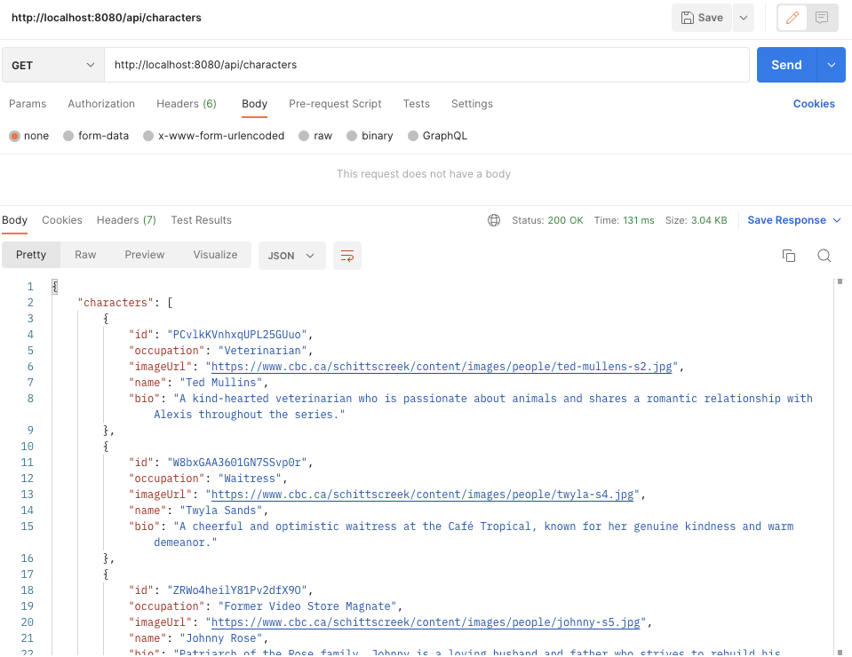
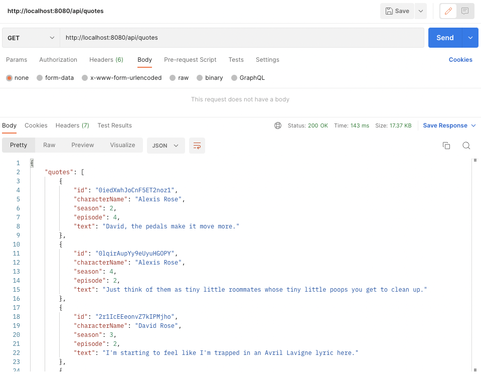

# Schitty API

Welcome to the Schitty API, your one-stop-shop for all things Schitt's Creek! We've got a treasure trove of information for fans and enthusiasts alike who want to incorporate the essence of the series into their applications, websites, or creative projects.

Our API provides detailed profiles of the intriguing characters that populate Schitt's Creek, including the loving Rose family, the quirky townsfolk, and everyone in between. Each character profile is packed with juicy details, making it easy to get to know your favorite Schitt's Creek residents.

We've also got a vast collection of memorable quotes from the show, capturing the witty banter, hilarious one-liners, and heartfelt moments that make Schitt's Creek so beloved. Developers can access quotes by specific characters or search for specific quotes, providing ample material to add a touch of the series' humor and charm to their projects.

Our seamless and intuitive interface offers various endpoints to retrieve character profiles, search for specific quotes, and discover quotes based on character. The API documentation provides clear guidelines on how to make API calls, including necessary parameters and response formats, making it easy to integrate the characters and quotes into your projects.

So why wait? Get ready to bring some Schitt to your project, and start integrating this fun and quirky API into your development workflow!

## Table of Schitty Contents

- [Features](#features)
- [API Documentation](#api-documentation)
- [Getting Started](#getting-started)
- [Installation](#installation)
- [Usage](#usage)


## Schitty Features

- Retrieve random quotes from Schitt's Creek characters
- Perform CRUD operations on characters and their quotes
- Interactive frontend showcasing character quotes
- Comprehensive API documentation
- Deployed and fully accessible via the internet

## Schitty API Documentation

The Schitty API documentation is generated using Docsify and hosted on GitHub Pages. Visit the API Documentation for a comprehensive guide on how to use the API: https://alexa-whitney.github.io/schitty-api/

### Getting Schitty Started

These instructions will help you set up and run the Schitty API on your local machine for development and testing purposes.

### Schitty Prerequisites

- Node.js (v14.x or higher)
- npm (v6.x or higher)
- MongoDB Atlas account
- Git

### Schitty Installation

1. Clone the repository:
   ```bash
   git clone https://github.com/alexa-whitney/Schitty-API.git
   cd Schitty-API
   ```

2. Install dependencies:
    ``` npm install ```

3. Run the development server:
    ```npm start```

4. Open your browser and navigate to http://localhost:8080 to view the frontend.

### Schitty Usage

Refer to the Schitty API Documentation for detailed information on the various Schitty API endpoints and how to use them.

### Schitty Characters
- `GET api/characters`: Retrieve a list of all Schitt's Creek characters.
- `GET api/characters/:characterId`: Retrieve a specific character by ID.
- `POST api/characters`: Add a new character.
- `PUT api/characters/:characterId`: Update an existing character.
- `DELETE api/characters/:characterId`: Delete a character.



#### Add a new Schitty character
To add a new character, make a POST request to /characters with the following request body:
```json
{
    "name": "Character name",
    "imageUrl": "URL for character image",
    "occupation": "Character occupation (ex. 'hotel owner')",
    "bio": "Character bio"
}
```
Ensure that you provide the required fields in the request body: name and description. The API will return the newly created character.

#### Update an existing Schitty character
To update an existing character, make a PUT request to /characters/:characterId with the following request body:
```json
{
    "name": "Updated character name",
    "imageUrl": "Updated URL for character image",
    "occupation": "Updated character occupation (ex. 'PR Princess')",
    "bio": "Updated character bio"
}
```

### Schitty Quotes

- `GET /quotes`: Get all quotes made by all Schitt's Creek characters.
- `GET /quotes/:quoteId`: Get a specific Schitty quote by ID.
- `POST /quotes`: Add a new Schitty quote.
- `PUT /quotes/:quoteId`: Update an existing Schitty quote.
- `DELETE /quotes/:quoteId`: Delete a quote.



#### Add a new Schitty quote
To add a new quote, make a `POST` request to `/quotes` with the following request body:
```json
{
    "characterName": "Name of the character who says the quote here",
    "text": "The actual quote text goes here",
    "season": "The season in which the quote appears goes here",
    "episode": "The episode in which the quote appears goes here"
}
```

#### Update a Schitty quote
To update an existing quote, make a PUT request to /quotes/:quoteId with the following request body:
```json
{
    "characterName": "The updated character name goes here",
    "text": "The updated quote text goes",
    "season": "The updated season number goes here",
    "episode": "The updated episode number goes here"
}
```
